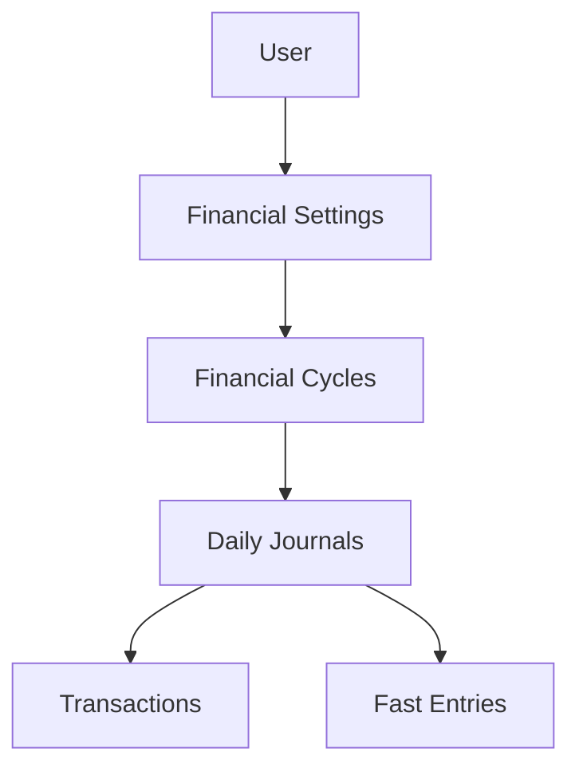

# 💰 Nukood

> **A student-first personal finance & shared living platform built with React, TypeScript, and Firebase.**

[]()
[]()
[]()
[]()

---

<p align="center">
  <em>Daily Journals • Financial Cycles • Smart Budgeting • Roomies • Financial Engine</em>
</p>

## Table of Contents
- [Project Overview](#project-overview)
- [Core Features](#core-features)
- [Tech Stack](#tech-stack)
- [Project Architecture](#project-architecture)
- [Financial Engine](#financial-engine)
- [Roomies](#roomies)
- [Project Structure](#project-structure)
- [Screenshots](#screenshots)
- [Future Roadmap](#future-roadmap)
- [Getting Started](#getting-started)
- [Contributing](#contributing)
- [License](#license)

## Project Overview

Nukood is a modern student-first personal finance and shared living platform designed to simplify money management for students and young professionals. 

Unlike traditional expense trackers, Nukood organizes financial activity into **Daily Journals** within **Financial Cycles**, making it easier to understand spending over time while maintaining accurate budgeting and financial insights.

The platform is built around a centralized **Financial Engine** responsible for all financial calculations including budgeting, remaining balance, daily spending recommendations, category summaries, budget health indicators and carry-forward calculations. 

The application also introduces **Roomies**, a shared living workspace that enables roommates to collaboratively manage groceries, shared expenses, inventories, utility bills and settlements. 

## Core Features

### Personal Finance
- **Daily Journals:** Contextualize spending day-by-day.
- **Financial Cycles:** Monthly structured budget periods.
- **Smart Budgeting:** Dynamic remaining balance pacing.
- **Carry Forward:** Seamlessly roll over unspent money.
- **Daily Spending Recommendation:** Actionable daily targets.
- **Budget Health Indicator:** At-a-glance pacing status.
- **Fast Entries:** Lightning-fast frequent transaction logging.
- **Transaction History:** Comprehensive search and filtering.
- **Archive:** Browse past financial cycles.
- **Receipt Attachments:** Upload bills and proof of payments.
- **Category Templates:** Customized forms for different spend types.
- **Activity Rings:** Visual breakdown of spending categories.
- **Spending Analytics:** In-depth insights into financial habits.

### Roomies
- **Shared Expenses:** Split costs fairly.
- **Grocery Management:** Track shared pantry items.
- **Inventory Management:** Monitor household supplies.
- **Utility Tracking:** Log recurring bills.
- **Settlement Tracking:** Keep tabs on who owes who.
- **Shared Shopping Lists:** Collaborative purchase planning.
- **House Insights:** Shared financial dashboard.

## Tech Stack

**Frontend**
- React
- TypeScript
- Vite

**Backend**
- Firebase Authentication
- Cloud Firestore
- Firebase Storage

**Architecture**
- Modular Backend Architecture
- Financial Engine
- Daily Journal Architecture
- Category-based Transaction Templates

## Project Architecture

Nukood is built with a highly structured, hierarchical architecture that ensures strict data boundaries and extremely fast contextual querying.



### Layer Responsibilities
- **User:** Root entity holding authentication and profile data.
- **Financial Settings:** Global configuration for budgets, health thresholds, and carry-forward rules.
- **Financial Cycles:** The active budget period (typically a month). Holds the snapshot of available balance and total cycle spending.
- **Daily Journals:** Aggregates transactions by day. Stores daily category breakdowns and transaction counts.
- **Transactions:** The atomic unit of spending, tied to category-specific templates.
- **Fast Entries:** User-defined shortcuts for rapid transaction creation.

### Transaction Processing Flow
Every transaction flows through the Financial Engine before being persisted. The engine:
1. Validates category-specific payloads.
2. Updates the atomic Transaction document.
3. Automatically increments/decrements the associated Daily Journal totals and Category Summaries.
4. Updates the overarching Financial Cycle's Total Spent.

## Financial Engine

The **Financial Engine** acts as the single source of truth for all complex financial logic. It is strictly responsible for dynamically calculating:

- **Remaining Balance**
- **Available Balance**
- **Daily Budget**
- **Budget Health**
- **Carry Forward**
- **Category Summary**
- **Dashboard Metrics**

> [!NOTE] 
> The Dashboard UI **never** performs standalone calculations. It acts simply as a presentation layer that displays processed, guaranteed values provided by the Financial Engine.

## Roomies

**Roomies** is a collaborative house management module built natively into Nukood. It bridges the gap between personal finance and shared living. 

It handles:
- **Shared Expenses**
- **Groceries**
- **Utilities**
- **Inventory**
- **Settlements**
- **Shopping Lists**

Roomies integrates seamlessly with Nukood's core financial architecture. A settlement or shared expense can be instantly pushed to your personal Financial Cycle as a standard transaction.

## Project Structure

```text
src/
├── app/               # UI Component library (shadcn/ui)
├── components/        # Reusable application components
├── constants/         # Configuration, templates, and maps
├── context/           # React Context (FinancialEngine)
├── features/          # Feature modules (Dashboard, History, etc.)
├── lib/               # 3rd party integrations (Firebase)
├── services/          # Firestore data access & business logic
├── styles/            # CSS and Tailwind configuration
├── types/             # TypeScript interfaces
└── utils/             # Helper functions and formatters
```

## Screenshots

### Dashboard
*(Add screenshot here)*

### Journal
*(Add screenshot here)*

### History
*(Add screenshot here)*

### Archive
*(Add screenshot here)*

### Roomies
*(Add screenshot here)*

### Settings
*(Add screenshot here)*

## Future Roadmap

- [ ] AI Spending Insights
- [ ] Predictive Budgeting
- [ ] OCR Receipt Scanner
- [ ] Bill Reminders
- [ ] Collaborative Financial Goals
- [ ] Export Reports
- [ ] Mobile App
- [ ] Notifications
- [ ] Offline Support

## Getting Started

1. Clone the repository
2. Install dependencies:
   ```bash
   npm install
   ```
3. Set up your Firebase credentials in `.env.local`
4. Start the development server:
   ```bash
   npm run dev
   ```

## Contributing

We welcome contributions from developers, designers, and finance enthusiasts! 
- Fork the repository.
- Create your feature branch (`git checkout -b feature/AmazingFeature`).
- Commit your changes (`git commit -m 'Add some AmazingFeature'`).
- Push to the branch (`git push origin feature/AmazingFeature`).
- Open a Pull Request.

## License

Distributed under the MIT License. See `LICENSE` for more information.