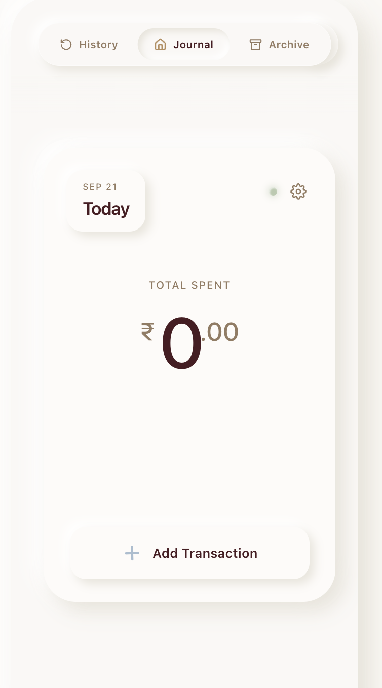
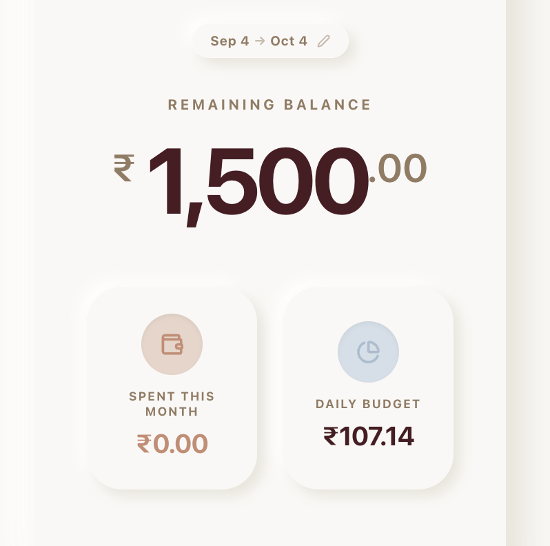
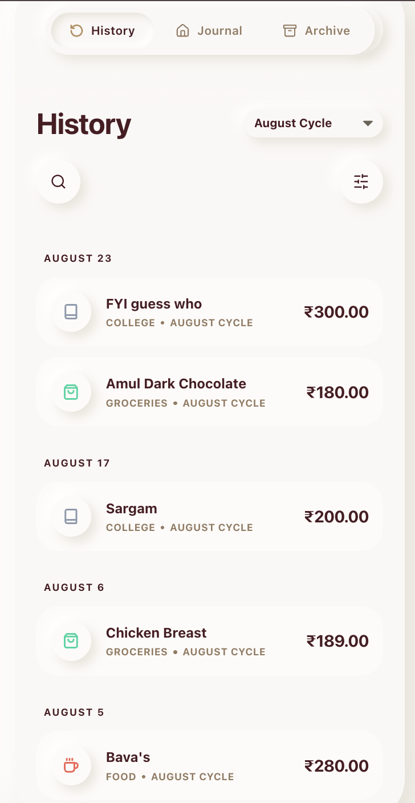
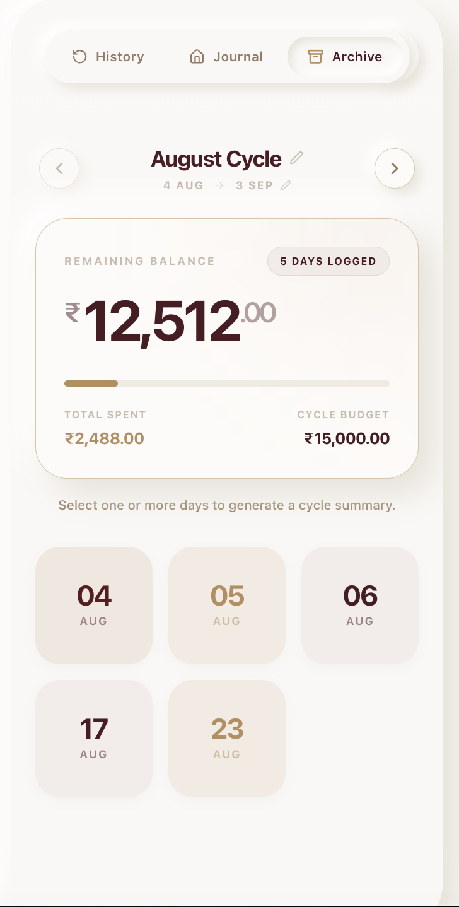

<p align="center">
  
</p>

<h1 align="center">Nukood</h1>

<p align="center">
  <strong>A student-first personal finance & shared living platform.</strong><br/>
  Plan Wise. Live Free.
</p>

<p align="center">
  <a href="https://github.com/Jeremy-James4948/Nukood"></a>
  <a href="https://github.com/Jeremy-James4948/Nukood"></a>
  <a href="https://github.com/Jeremy-James4948/Nukood"></a>
  <a href="https://github.com/Jeremy-James4948/Nukood"></a>
  <a href="https://github.com/Jeremy-James4948/Nukood"></a>
  <a href="LICENSE"></a>
</p>

---

## What is Nukood?

Most budgeting apps are built for accountants, not students. They're cluttered, cold, and disconnected from how young people actually think about money.

**Nukood** is different. It organizes your financial life into **Financial Cycles** and **Daily Journals** — a natural, diary-like structure that mirrors how you actually spend. Every rupee is tracked contextually, not just as a number in a spreadsheet.

And when you share a space with others, **Roomies** handles the rest — groceries, utilities, settlements, and shared expenses, all connected to your personal finance in one place.

---

## Screenshots

<table>
  <tr>
    <td align="center">
      <br/>
      <sub><b>Dashboard</b></sub><br/>
      <sub>Remaining balance, daily budget & cycle overview</sub>
    </td>
    <td align="center">
      <br/>
      <sub><b>Daily Journal</b></sub><br/>
      <sub>Log transactions day-by-day</sub>
    </td>
    <td align="center">
      <br/>
      <sub><b>History</b></sub><br/>
      <sub>Searchable, filterable transaction log</sub>
    </td>
    <td align="center">
      <br/>
      <sub><b>Archive</b></sub><br/>
      <sub>Browse & summarize past financial cycles</sub>
    </td>
  </tr>
</table>

---

## Core Features

### 💰 Personal Finance

| Feature | Description |
|---|---|
| **Daily Journals** | Contextualize spending day-by-day within a cycle |
| **Financial Cycles** | Monthly structured budget periods with full snapshots |
| **Smart Budgeting** | Dynamic remaining balance pacing across the cycle |
| **Carry Forward** | Seamlessly roll unspent money into the next cycle |
| **Daily Spending Recommendation** | Actionable daily targets based on remaining balance |
| **Budget Health Indicator** | At-a-glance pacing status (healthy / at-risk / over) |
| **Fast Entries** | Lightning-fast shortcuts for frequent transactions |
| **Transaction History** | Comprehensive search and filtering across all cycles |
| **Archive** | Browse, compare, and summarize past financial cycles |
| **Receipt Attachments** | Upload bills and proof of payments |
| **Category Templates** | Customized forms for different spend types |
| **Activity Rings** | Visual breakdown of spending by category |
| **Spending Analytics** | In-depth insights into financial habits |

### 🏠 Roomies

| Feature | Description |
|---|---|
| **Shared Expenses** | Split costs fairly between housemates |
| **Grocery Management** | Track shared pantry and grocery items |
| **Inventory Management** | Monitor household supplies |
| **Utility Tracking** | Log and split recurring bills |
| **Settlement Tracking** | Keep tabs on who owes who |
| **Shared Shopping Lists** | Collaborative purchase planning |
| **House Insights** | Shared financial dashboard for the household |

---

## Tech Stack

**Frontend**
- [React 18](https://react.dev/) + [TypeScript 5](https://www.typescriptlang.org/)
- [Vite 6](https://vitejs.dev/) — build tooling
- [Radix UI](https://www.radix-ui.com/) — accessible component primitives
- [Motion](https://motion.dev/) — animations
- [Recharts](https://recharts.org/) — financial data visualization
- [Tailwind CSS 4](https://tailwindcss.com/) — utility-first styling
- [Lucide React](https://lucide.dev/) — icons

**Backend**
- [Firebase Firestore](https://firebase.google.com/products/firestore) — real-time database
- [Firebase Authentication](https://firebase.google.com/products/auth) — user auth
- [Firebase Storage](https://firebase.google.com/products/storage) — receipt attachments

---

## Architecture

Nukood uses a strict hierarchical data model that enforces clean boundaries between financial entities and enables extremely fast contextual querying.

```
User
 └── Financial Settings
      └── Financial Cycles
           └── Daily Journals
                ├── Transactions
                └── Fast Entries
```

### Financial Engine

The **Financial Engine** is the single source of truth for all financial logic. The UI is a pure presentation layer — it never performs standalone calculations.

Every transaction is processed through the engine, which:
1. Validates the category-specific payload
2. Persists the atomic Transaction document
3. Updates Daily Journal totals and Category Summaries
4. Propagates changes up to the Financial Cycle's Total Spent

The engine guarantees these values on every render:

| Value | Description |
|---|---|
| `remainingBalance` | Budget minus total spent |
| `availableBalance` | Remaining adjusted for carry-forward |
| `dailyBudget` | Available balance ÷ days remaining |
| `budgetHealth` | Pacing status (healthy / at-risk / over) |
| `carryForward` | Surplus rolled from the previous cycle |
| `categorySummary` | Per-category totals for the active cycle |
| `dashboardMetrics` | Pre-computed display values for the UI |

> [!NOTE]
> The Dashboard UI **never** performs standalone calculations. It acts simply as a presentation layer that displays processed, guaranteed values provided by the Financial Engine.

---

## Project Structure

```
src/
├── app/               # Root app shell and routing
├── components/        # Reusable UI components
├── constants/         # Config, templates, and category maps
├── context/           # FinancialEngineContext (global state)
├── features/          # Feature modules
│   ├── dashboard/     # Cycle overview & metrics
│   ├── journal/       # Daily journal & transaction entry
│   ├── history/       # Transaction log & search
│   ├── archive/       # Past cycle browser
│   ├── onboarding/    # New user setup flow
│   ├── settings/      # App and cycle configuration
│   └── snapshot/      # Cycle snapshot & editor
├── lib/               # Firebase initialization
├── services/          # Firestore data access & business logic
├── styles/            # Global CSS and theme tokens
├── types/             # TypeScript interfaces
└── utils/             # Helpers and formatters
```

---

## Themes

Nukood ships with three carefully designed themes:

| Theme | Aesthetic | Primary Color |
|---|---|---|
| **Normal** | Warm, neumorphic, organic | `#355C7D` |
| **Light** | Airy, frosted, soft blue | `#2F4B7C` |
| **Dark** | Deep atmospheric black, maroon accents | `#1A1F2E` |

---

## Getting Started

### Prerequisites
- Node.js 18+
- A Firebase project with Firestore and Storage enabled

### Installation

```bash
# 1. Clone the repository
git clone https://github.com/Jeremy-James4948/Nukood.git
cd Nukood

# 2. Install dependencies
npm install

# 3. Set up environment variables
cp .env.example .env.local
# Fill in your Firebase credentials in .env.local

# 4. Start the development server
npm run dev
```

### Environment Variables

Create a `.env.local` file in the project root:

```env
VITE_FIREBASE_API_KEY=
VITE_FIREBASE_AUTH_DOMAIN=
VITE_FIREBASE_PROJECT_ID=
VITE_FIREBASE_STORAGE_BUCKET=
VITE_FIREBASE_MESSAGING_SENDER_ID=
VITE_FIREBASE_APP_ID=
```

> **Note:** During development, a temporary dev auth system is active. Firebase Authentication is not required to run the app locally.

---

## Roadmap

- [ ] AI Spending Insights
- [ ] Predictive Budgeting
- [ ] OCR Receipt Scanner
- [ ] Bill Reminders
- [ ] Collaborative Financial Goals
- [ ] Export Reports (PDF / CSV)
- [ ] Mobile App
- [ ] Push Notifications
- [ ] Offline Support (PWA)

---

## Contributing

Contributions are welcome from developers, designers, and finance enthusiasts!

1. Fork the repository
2. Create your feature branch: `git checkout -b feature/AmazingFeature`
3. Commit your changes: `git commit -m 'Add AmazingFeature'`
4. Push to the branch: `git push origin feature/AmazingFeature`
5. Open a Pull Request

> Please ensure your changes respect the Financial Engine contract — the UI must never perform standalone financial calculations.

---

## License

Distributed under the MIT License. See [`LICENSE`](LICENSE) for more information.

---

<p align="center">
  Built with ❤️ for students who want to own their money.
</p>

