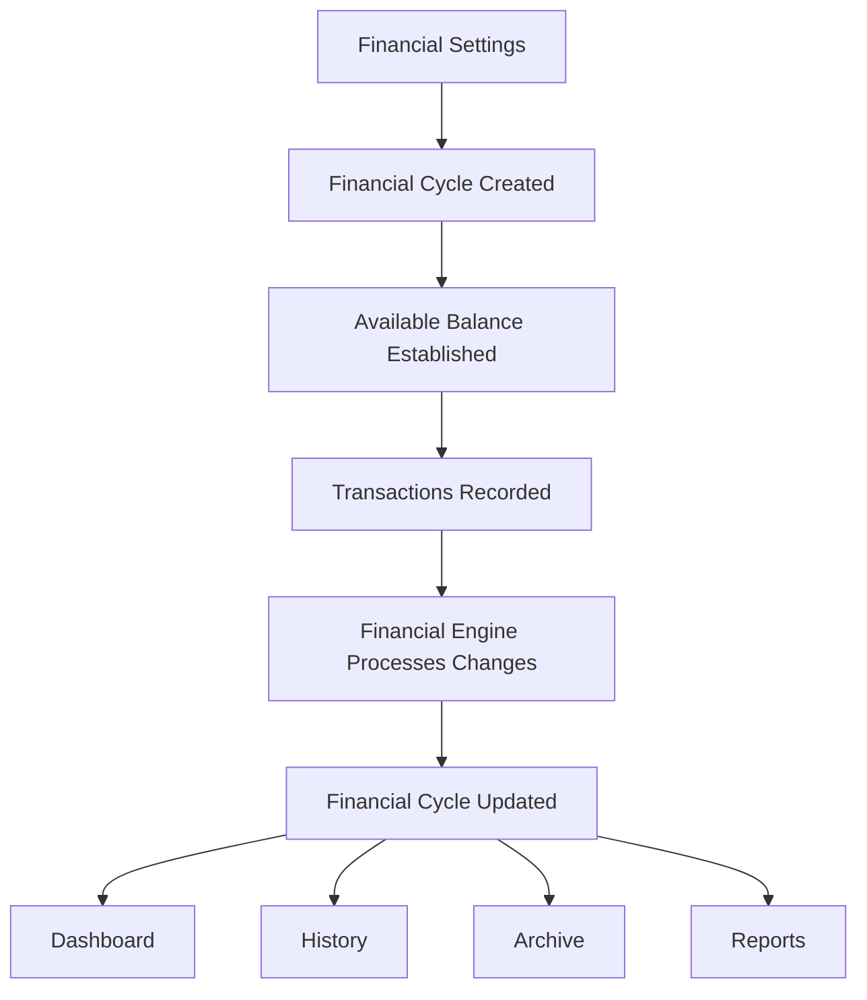

# Financial Engine

## Overview
The Financial Engine is the central business logic responsible for maintaining the user's financial state throughout the application.

It acts as the single source of truth for all financial calculations.
Whenever financial activity occurs, the Financial Engine updates the user's current Financial Cycle and produces the values required by the Dashboard, History, Archive and Reports.

The Financial Engine is **not** a Firestore collection.
It is a backend service that processes Transactions and maintains financial consistency across the application.

## Responsibilities
The Financial Engine is responsible for:
- Managing Financial Cycle balances.
- Processing Transaction impact.
- Maintaining spending totals.
- Calculating Remaining Balance.
- Calculating Daily Available Budget.
- Determining Budget Health.
- Managing Carry Forward.
- Providing Dashboard metrics.

The Financial Engine is **not** responsible for:
- Storing Transactions.
- Managing Categories.
- Managing Fast Entries.
- Rendering UI.
- Displaying Reports.

## Financial Flow

## Stored Financial Values
The following values are permanently stored within each Financial Cycle.

### Monthly Budget
- **Source**: Financial Settings
- **Description**: Budget allocated for the current Financial Cycle.

### Carry Forward
- **Source**: Previous Financial Cycle
- **Description**: Remaining balance transferred into the new Financial Cycle.

### Available Balance
- **Formula**: `Available Balance = Monthly Budget + Carry Forward`
- **Description**: Opening balance available for the Financial Cycle. This value is initially established when the cycle is created but dynamically increases as Income Transactions are recorded.

### Total Spent
- **Description**: Running total of all Expense Transactions recorded within the Financial Cycle. Automatically updated whenever Transactions change.

### Transaction Count
- **Description**: Total number of Transactions recorded during the Financial Cycle. Automatically maintained.

## Calculated Values
The following values are **never stored permanently**. They are calculated whenever required.

### Remaining Balance
- **Formula**: `Remaining Balance = Available Balance - Total Spent`

### Remaining Days
- **Formula**: `Remaining Days = End Date - Current Date`

### Daily Available Budget
- **Formula**: `Daily Available Budget = Remaining Balance ÷ Remaining Days`
- **Description**: Represents the maximum recommended amount the user can spend each remaining day while staying within budget.

### Percentage Used
- **Formula**: `Percentage Used = (Total Spent ÷ Available Balance) × 100`

### Budget Health Indicator
The Budget Health Indicator evaluates whether the user's current spending behaviour is sustainable for the remainder of the Financial Cycle.

The indicator is calculated using:
- Remaining Balance
- Remaining Days
- Daily Available Budget
- User-defined threshold settings

The Financial Engine returns one of the following statuses:
- On Track
- Tight Budget
- Overspending

The Dashboard determines how these statuses are visually represented.

## Financial Events
The Financial Engine reacts to the following events.

### Transaction Created
When a new Transaction is saved:
1. Validate Transaction.
2. Assign Financial Cycle.
3. Update Total Spent (if Expense) OR Update Available Balance (if Income).
4. Update Transaction Count.
5. Recalculate Remaining Balance.
6. Recalculate Daily Available Budget.
7. Recalculate Budget Health.

### Transaction Updated
When an existing Transaction is edited:
1. Remove previous Transaction impact.
2. Apply updated Transaction values.
3. Update Total Spent (if Expense) OR Update Available Balance (if Income).
4. Recalculate Remaining Balance.
5. Recalculate Daily Available Budget.
6. Recalculate Budget Health.

### Transaction Deleted
When a Transaction is removed:
1. Reverse Transaction impact.
2. Reduce Total Spent (if Expense) OR Reduce Available Balance (if Income).
3. Reduce Transaction Count.
4. Recalculate Remaining Balance.
5. Recalculate Daily Available Budget.
6. Recalculate Budget Health.

### Financial Cycle Created
When a new Financial Cycle begins:
1. Read Monthly Budget from Financial Settings.
2. Calculate Carry Forward from previous Financial Cycle.
3. Calculate Available Balance.
4. Create new Financial Cycle.
5. Mark previous Financial Cycle as Completed.

## Integrations

### Dashboard Integration
The Dashboard never performs financial calculations. Instead, it requests processed values from the Financial Engine.
Examples include:
- Available Balance
- Total Spent
- Remaining Balance
- Daily Available Budget
- Budget Health

This ensures all calculations remain centralized.

### History Integration
History retrieves Transactions grouped by Financial Cycle. The Financial Engine provides the financial values required for summaries.

### Archive Integration
Archive retrieves completed Financial Cycles. The Financial Engine provides historical balances and spending information.

### Reports Integration
Reports use Financial Engine calculations together with Transaction data to generate analytics. No report should calculate financial values independently.

## Business Rules

- **Rule 1**: All financial calculations must originate from the Financial Engine.
- **Rule 2**: Dashboard, History, Archive and Reports must never implement independent financial calculations.
- **Rule 3**: Every Transaction immediately updates the current Financial Cycle.
- **Rule 4**: Only Expense Transactions increase Total Spent. Income Transactions increase Available Balance for the current Financial Cycle.
- **Rule 5**: Carry Forward is calculated only once when a new Financial Cycle is created.
- **Rule 6**: Available Balance is initially established at the beginning of a Financial Cycle, and dynamically increases when Income Transactions are recorded.
- **Rule 7**: Remaining Balance is always calculated dynamically. It is never stored.
- **Rule 8**: Daily Available Budget is always calculated dynamically. It is never stored.
- **Rule 9**: Budget Health is always calculated dynamically. It is never stored.

## Architecture Principles
The Financial Engine is the single source of truth for all financial calculations.
Transactions create financial events.
Financial Cycles store financial state.
The Financial Engine maintains that state.
Dashboard, History, Archive and Reports consume that state without duplicating calculation logic.
This architecture ensures consistency, scalability and maintainability throughout the application.
